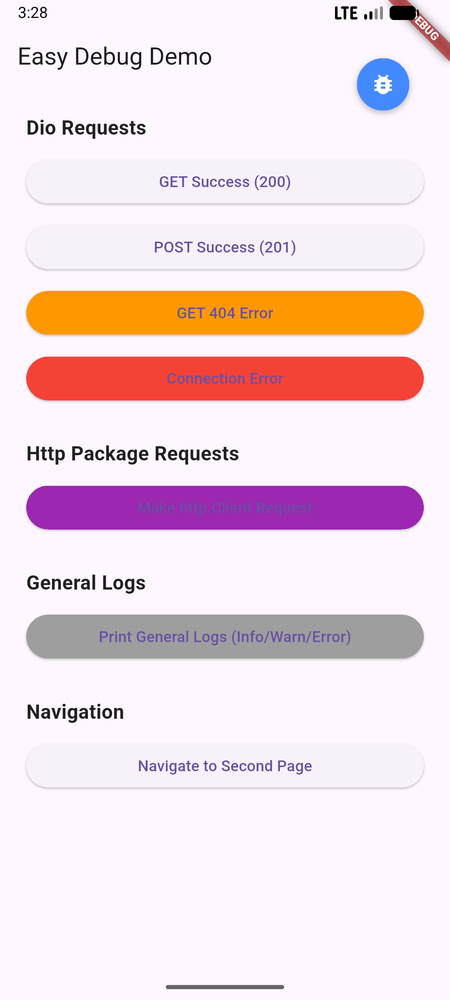
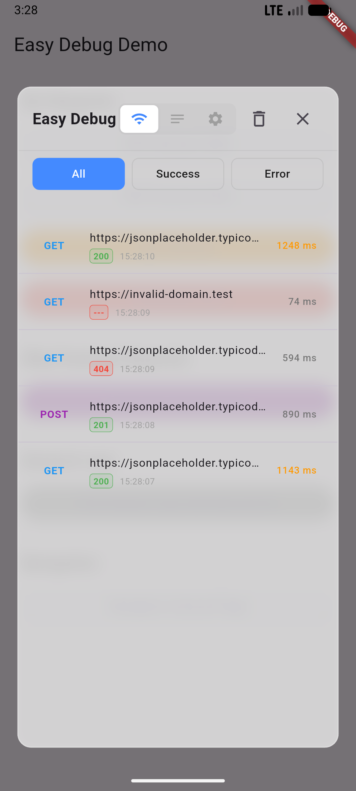
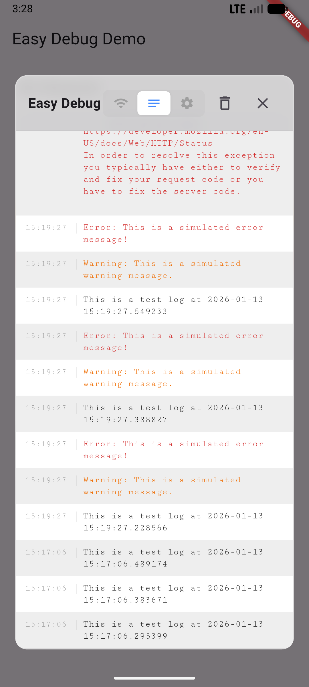
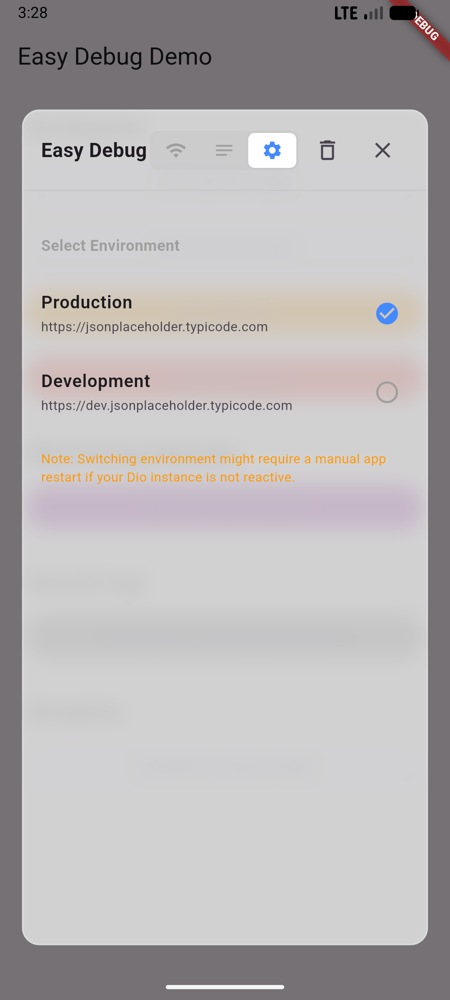
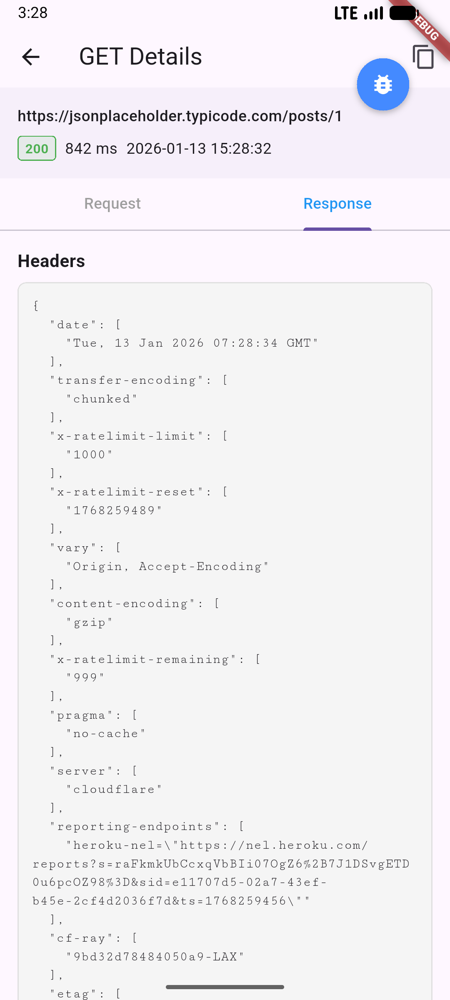

# Easy Debug

A pure Dart, lightweight, and powerful in-app network debugger for Flutter.
`easy_debug` provides a floating overlay to monitor your Dio network requests in real-time, inspect details, and manage logs without connecting to an external debugger.

## Screenshots

<div style="text-align: center">
  
  
  
</div>
<div style="text-align: center">
  
  
</div>

## Features

*   🚀 **Pure Dart**: No native dependencies, works on all Flutter platforms (Android, iOS, Web, Desktop).
*   🌐 **Universal Network Support**: Supports both **Dio** and standard **http** package.
*   📝 **General Logs**: Capture `debugPrint` and `EasyDebug.log` messages in a dedicated terminal-style tab.
*   📱 **Floating Overlay**: Always accessible Draggable floating button.
*   💎 **Glassmorphism UI**: Modern, semi-transparent design.
*   🌍 **Environment Switcher**: Switch API environments (Dev/Prod) at runtime with persistence.
*   🔍 **Detailed Inspection**: View headers, body, timestamp, and duration for Requests and Responses.
*   📂 **Categorization**: Filter network logs by "All", "Success", or "Error" tabs.
*   📋 **Smart Copy**: One-tap copy for Request/Response/Log content.
*   🧹 **Log Management**: Auto-clearing (optional) and manual clear support.

## Installation

Add `easy_debug` to your `pubspec.yaml`:

```yaml
dependencies:
  easy_debug:
    path: ./ # Or git/pub version
```

## Setup

### 1. Initialize & Wrap MaterialApp

Wrap your app with `EasyDebugWidget` using the `builder` property of `MaterialApp` (or `CupertinoApp`).
Also, add the `EasyDebugNavigatorObserver` to handle navigation correctly (e.g., closing overlay on page changes or handling context).

```dart
import 'package:easy_debug/easy_debug.dart';

void main() {
  runApp(const MyApp());
}

class MyApp extends StatelessWidget {
  const MyApp({super.key});

  @override
  Widget build(BuildContext context) {
    return MaterialApp(
      title: 'Easy Debug Example',
      // 1. Wrap your app in the builder
      builder: (context, child) {
        return EasyDebugWidget(child: child!);
      },
      // 2. Add the navigator observer
      navigatorObservers: [
        EasyDebugNavigatorObserver(),
      ],
      home: const MyHomePage(),
    );
  }
}
```

### 2. Add Dio Interceptor

Attach the `EasyDebugDioInterceptor` to your Dio instance to start capturing network events.

```dart
final dio = Dio();

// Add the interceptor
dio.interceptors.add(EasyDebugDioInterceptor());
```

### 3. Usage with clean `http` package (If necessary)

To debug requests made with the `http` package, simply wrap your client with `EasyDebugHttpClient`.

```dart
import 'package:http/http.dart' as http;
import 'package:easy_debug/easy_debug.dart';

final client = EasyDebugHttpClient(http.Client());

// Use as normal
final response = await client.get(Uri.parse('https://example.com'));
```

## Environment Switching

Easy Debug allows you to switch API environments (e.g., Dev, Test, Prod) at runtime.

### 1. Initialize Environments

Initialize the manager with your environment list in `main()` before `runApp`.

```dart
void main() async {
  WidgetsFlutterBinding.ensureInitialized();
  
  await EasyDebugManager().init(environments: [
      const AppEnvironment(
        name: 'Production',
        baseUrl: 'https://api.example.com',
        isDefault: true,
      ),
       const AppEnvironment(
        name: 'Development',
        baseUrl: 'https://dev.api.example.com',
        baseUrl: 'https://dev.api.example.com',
      ),
  ]);
  
  runApp(const MyApp());
}
```

### 2. Use Dynamic Base URL

Update your Dio client to listen for environment changes.

```dart
class _MyAppState extends State<MyApp> {
  final Dio _dio = Dio();

  @override
  void initState() {
    super.initState();
    // Set initial URL
    _dio.options.baseUrl = EasyDebugManager().currentBaseUrl;
    
    // Listen for changes
    EasyDebugManager().currentEnvNotifier.addListener(() {
      final newEnv = EasyDebugManager().currentEnvNotifier.value;
      if (newEnv != null) {
        _dio.options.baseUrl = newEnv.baseUrl;
      }
    });
  }
}
```

## Usage

*   **Open Console**: Tap the 🐞 floating button.
*   **Switch Views**: Use the header tabs to switch between **Network**, **Logs**, and **Settings**.
*   **Network Tab**: View Dio/Http requests. Filter by "All", "Success", or "Error".
*   **Logs Tab**: View `debugPrint` output with timestamp and coloring. Tap any row to copy.
*   **Settings Tab**: Switch environments.
*   **View Details**: Tap any network log item to see full Request/Response details.
*   **Smart Copy**: Tap the copy icon in detailed view, or tap any row in the Logs tab to copy content.
*   **Clear Logs**: Tap the Trash icon in the console header.

## Configuration

You can configure global settings via `EasyDebugManager`.

```dart
EasyDebugManager().updateConfig(
  EasyDebugConfig(
    maxLogCount: 100, // Maximum logs to keep in memory
    clearOnNavigation: false, // Auto clear logs when navigating pages
  ),
);
```


## Author

Created by **JasonBoolean**.

## License

This project is licensed under the MIT License - see the [LICENSE](LICENSE) file for details.

